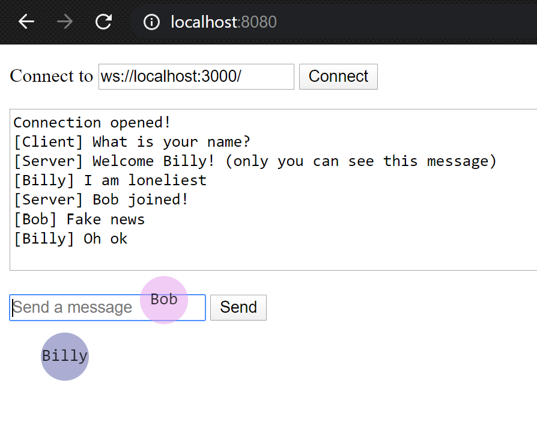

# dumb-multiplayer-server

Using WebSockets for some epic communication skills

To try this out:
```sh
npm start
```
Then go to http://localhost:8080/

### YouTube demo

[](https://www.youtube.com/watch?v=lJ3Rs3_lVeU)

### Screenshots


